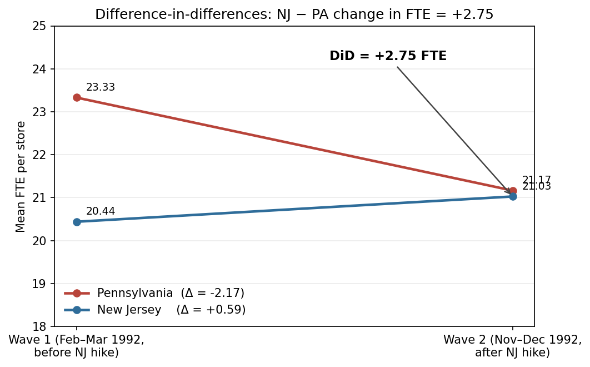
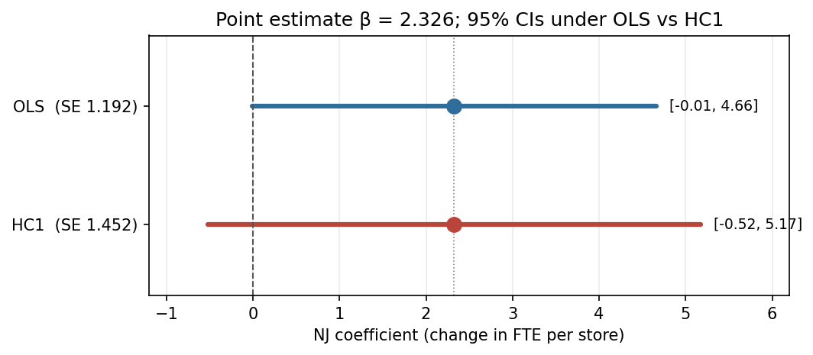

```{=html}
<!-- ═══════════════════════════════════════════════════════════
     NAVBAR — uses ../ prefix (posts/ subdirectory)
═══════════════════════════════════════════════════════════════ -->
<header class="navbar">
  <a href="../index.html" class="nav-logo">YT.</a>

  <nav class="nav-links">
    <a href="../index.html"    class="nav-link">Home</a>
    <a href="../projects.html" class="nav-link">Projects</a>
    <a href="../blog.html"     class="nav-link">Writing</a>
    <a href="../resume.html"   class="nav-link">Resume</a>
    <a href="../about.html"    class="nav-link">About</a>
  </nav>

  <div class="nav-right">
    <a href="https://github.com/rsm-ytiwari" target="_blank" rel="noopener" class="nav-icon" aria-label="GitHub">
      <svg width="17" height="17" viewBox="0 0 24 24" fill="none" stroke="currentColor" stroke-width="2" stroke-linecap="round" stroke-linejoin="round">
        <path d="M9 19c-5 1.5-5-2.5-7-3m14 6v-3.87a3.37 3.37 0 0 0-.94-2.61c3.14-.35 6.44-1.54 6.44-7A5.44 5.44 0 0 0 20 4.77 5.07 5.07 0 0 0 19.91 1S18.73.65 16 2.48a13.38 13.38 0 0 0-7 0C6.27.65 5.09 1 5.09 1A5.07 5.07 0 0 0 5 4.77a5.44 5.44 0 0 0-1.5 3.78c0 5.42 3.3 6.61 6.44 7A3.37 3.37 0 0 0 9 18.13V22"/>
      </svg>
    </a>
    <a href="https://www.linkedin.com/in/yash-tiwari-here/" target="_blank" rel="noopener" class="nav-icon" aria-label="LinkedIn">
      <svg width="17" height="17" viewBox="0 0 24 24" fill="none" stroke="currentColor" stroke-width="2" stroke-linecap="round" stroke-linejoin="round">
        <path d="M16 8a6 6 0 0 1 6 6v7h-4v-7a2 2 0 0 0-2-2 2 2 0 0 0-2 2v7h-4v-7a6 6 0 0 1 6-6z"/>
        <rect x="2" y="9" width="4" height="12"/><circle cx="4" cy="4" r="2"/>
      </svg>
    </a>
    <button class="nav-icon" aria-label="Search">
      <svg width="17" height="17" viewBox="0 0 24 24" fill="none" stroke="currentColor" stroke-width="2" stroke-linecap="round" stroke-linejoin="round">
        <circle cx="11" cy="11" r="8"/><line x1="21" y1="21" x2="16.65" y2="16.65"/>
      </svg>
    </button>
    <button class="theme-pill" id="theme-toggle" aria-label="Toggle theme">
      <span id="theme-icon">
        <svg width="13" height="13" viewBox="0 0 24 24" fill="none" stroke="currentColor" stroke-width="2" stroke-linecap="round" stroke-linejoin="round">
          <path d="M21 12.79A9 9 0 1 1 11.21 3 7 7 0 0 0 21 12.79z"/>
        </svg>
      </span>
      <span id="theme-label">Dark</span>
    </button>
  </div>
</header>


<!-- ═══════════════════════════════════════════════════════════
     POST BANNER
═══════════════════════════════════════════════════════════════ -->
<div class="post-banner">
  <a href="../blog.html" class="back-link">← All Writing</a>
  <div class="post-meta-row">
    <span class="p-year">Apr 2026</span>
    <span class="post-sep">·</span>
    <span class="b-read-time">8 min read</span>
    <span class="post-sep">·</span>
    <span class="p-year">Data Science</span>
  </div>
  <h1 class="post-title">Replicating Card &amp; Krueger (1994): When the Minimum Wage Didn&rsquo;t Bite</h1>
  <p class="post-subtitle">
    A classic labor-econ puzzle, re-run from the raw survey data &mdash; and a look at what robust standard errors do to the headline.
  </p>
</div>
```

::: {.post-body}

Textbook intuition says raising the minimum wage should shrink employment: the price of labor goes up, quantity demanded goes down. In 1992, New Jersey handed economists a natural experiment — it raised the state minimum from \$4.25 to \$5.05 while Pennsylvania kept theirs unchanged — and David Card and Alan Krueger walked 410 fast-food restaurants in both states through a before-and-after survey. When they ran the difference-in-differences, the sign flipped: NJ employment *rose* slightly relative to PA. The paper became one of the most-cited results in applied labor economics and earned Card a Nobel in 2021.

This post re-runs their numbers from the original `public.dat` file, lands the headline coefficient essentially on top of the paper's (2.326 vs. 2.33), and then asks a small follow-up question the paper doesn't: **what happens if you relax the assumption that store-level variance is constant?** The point estimate survives. The significance doesn't.

## Caveats up front

Before the numbers, a quick honesty ledger:

- **All three anchor checks hit.** NJ wave-1 FTE = 20.44, PA wave-1 FTE = 23.33, Table 4 NJ coefficient = 2.326 with OLS SE 1.192 (paper: 20.44 / 23.33 / 2.33 / 1.19). N = 357.
- **One numerical quirk.** Table 3's row 3 "Change in FTE" depends on how you compute it. Computing it as the **difference of the two period means** — what the paper appears to do, and what the figure below visualises — gives PA = −2.17, NJ = +0.59, DiD = +2.75 (paper +2.76). Computing it as the **mean of per-store changes** — the more natural `EMPTOT2 − EMPTOT` approach my `build.py` uses — gives PA = −2.28, NJ = +0.47, DiD = +2.75. Same DiD, 0.12-FTE drift in the individual state means. The gap reflects minor sample asymmetries (a few stores appear in one wave but not the other), not a real disagreement.
- **Everything below comes from a single run of [`src/build.py`](https://github.com/rsm-ytiwari)**, no manual adjustment.

## What the paper studies

In April 1992, New Jersey raised its minimum wage from \$4.25 to \$5.05/hr while neighboring Pennsylvania kept its minimum unchanged. Card and Krueger surveyed 410 fast-food restaurants (Burger King, KFC, Roy Rogers, Wendy's) in both states shortly before and about eight months after the increase, then used a difference-in-differences design to estimate the employment effect. The conventional prediction — that a binding minimum wage reduces employment — would have NJ employment fall relative to PA. Instead, the authors find the opposite: employment at NJ stores rose *slightly* relative to PA stores, yielding a positive (statistically weak) treatment effect on full-time-equivalent employment.

**FTE** is defined as `full-time workers + 0.5 × part-time workers + managers`. So a store with 10 full-timers, 8 part-timers, and 2 managers counts as 10 + 4 + 2 = 16 FTE.

## Replication setup

Data: the authors' `public.dat` (410 stores × 46 variables, two survey waves), parsed per the column order in their own `check.sas` input script. Derived variables (`EMPTOT`, `DEMP`, `GAP`, chain dummies, etc.) follow `check.sas` verbatim. The full pipeline — parse → derive → fit — runs as a single script end-to-end.

## Table 2 — Store characteristics by state

Means of key store characteristics in wave 1 (pre-hike) and wave 2 (post-hike), separately for Pennsylvania (NJ = 0) and New Jersey (NJ = 1). Replicated values match the published table to within rounding.

| Variable | PA mean | PA SE | NJ mean | NJ SE | NJ − PA |
|---|---:|---:|---:|---:|---:|
| BK (share Burger King) | 0.443 | 0.056 | 0.411 | 0.027 | −0.032 |
| KFC | 0.152 | 0.041 | 0.205 | 0.022 | 0.054 |
| Roy Rogers | 0.215 | 0.047 | 0.248 | 0.024 | 0.033 |
| Wendy's | 0.190 | 0.044 | 0.136 | 0.019 | −0.054 |
| Company-owned | 0.354 | 0.054 | 0.341 | 0.026 | −0.013 |
| FTE (wave 1) | 23.331 | 1.351 | 20.439 | 0.508 | **−2.892** |
| % full-time (wave 1) | 0.350 | 0.027 | 0.328 | 0.013 | −0.022 |
| Starting wage (wave 1) | 4.630 | 0.040 | 4.612 | 0.020 | −0.018 |
| At minimum (wave 1) | 0.329 | 0.053 | 0.305 | 0.025 | −0.024 |
| Meal price (wave 1) | 3.042 | 0.069 | 3.351 | 0.037 | 0.309 |
| Hours open (wave 1) | 14.525 | 0.332 | 14.418 | 0.153 | −0.107 |
| Bonus program | 0.291 | 0.051 | 0.236 | 0.023 | −0.055 |
| FTE (wave 2) | 21.166 | 0.943 | 21.027 | 0.520 | **−0.138** |
| % full-time (wave 2) | 0.304 | 0.028 | 0.359 | 0.014 | 0.055 |
| Starting wage (wave 2) | 4.617 | 0.042 | 5.081 | 0.006 | **0.463** |
| At new minimum (wave 2) | 0.013 | 0.013 | 0.855 | 0.019 | **0.842** |
| Meal price (wave 2) | 3.027 | 0.067 | 3.415 | 0.036 | 0.388 |
| Hours open (wave 2) | 14.654 | 0.327 | 14.420 | 0.152 | −0.234 |
| Special low-wage exemption | 0.234 | 0.049 | 0.203 | 0.023 | −0.031 |

Two things jump out:

1. **The treatment did bite.** NJ's share of stores at the prevailing minimum jumped from 30.5% to 85.5% after April 1992 — almost every NJ store was now paying exactly \$5.05. PA didn't move. This is a binding wage floor, not a nominal one.
2. **NJ stores were smaller to begin with.** Wave-1 FTE is 20.4 in NJ vs. 23.3 in PA — a baseline gap of ~2.9 FTE. Any credible DiD has to explain why that gap shrinks after the wage hike.

## Table 3 — FTE before, after, and change

| | PA mean | PA SE | NJ mean | NJ SE | NJ − PA | Diff SE |
|---|---:|---:|---:|---:|---:|---:|
| FTE before | 23.331 | 1.351 | 20.439 | 0.508 | −2.892 | 1.444 |
| FTE after  | 21.166 | 0.943 | 21.027 | 0.520 | −0.138 | 1.077 |
| Change in FTE | −2.283 | 1.253 | 0.467 | 0.481 | **+2.750** | 1.342 |

The headline is the last cell: the NJ − PA difference in FTE change is **+2.75** (paper reports **+2.76**). Positive. Opposite sign from the textbook. The 0.12-FTE drift on the individual PA / NJ change values is the quirk flagged in the caveats above — it comes from using mean-of-per-store-changes instead of difference-of-means, and the DiD is identical either way.



The picture is the whole paper in one chart. If you believe PA was a valid counterfactual — that NJ stores would have followed the same trend absent the hike — you read the gap between the two lines at wave 2 as the causal effect of the minimum wage on employment. And that gap is positive.

## Table 4 col (i) — Difference-in-differences regression

The same result, one more time, as a regression. Change in FTE is regressed on a New Jersey dummy. The sample follows `check.sas:152-153`: stores with a valid wave-2 employment reading, either a valid wage change or permanent closure. N = 357.

| | Coefficient | OLS SE | HC1 SE |
|---|---:|---:|---:|
| Constant | −2.127 | 1.074 | 1.372 |
| NJ dummy | **2.326** | **1.192** | **1.452** |

The NJ coefficient is **2.326** with OLS standard error **1.192**, against the paper's 2.33 (1.19). Point estimate and standard error both match essentially exactly. The coefficient reads as "NJ stores gained roughly 2.3 FTE per store relative to PA stores after the minimum wage rose," and is marginally significant under OLS (t ≈ 1.95, so the 95% CI just barely touches zero).

## Additional — robust standard errors

The paper reports plain OLS standard errors, which assume residual variance is constant across stores. That assumption is suspect here on inspection alone: a store employing 40 FTE has far more room to swing by ±5 workers than a store employing 10. Splitting the Table 4 sample at the median baseline FTE (19.5) makes the asymmetry concrete — residual variance is **41.7** among small stores versus **102.2** among large stores, a ratio of **2.45×**. That's textbook heteroskedasticity.

Heteroskedasticity-consistent (HC1) standard errors are the minimal fix. The HC1 standard error on the NJ coefficient is **1.452** — about 22% larger than the OLS 1.192. Under HC1, the coefficient is no longer significant at conventional levels (t ≈ 1.60, p ≈ 0.11). The point estimate — the core finding — is unchanged. But inference tightens from "marginally positive" to "statistically indistinguishable from zero" once heteroskedasticity is allowed in.



This doesn't overturn Card & Krueger's broader evidence — the 1994 paper rests on many specifications, including the wage-gap regressions in Table 4 columns iii–v, and the book-length follow-up marshalls much more. But it does illustrate how sensitive the headline t-statistic is to a standard-error choice that rarely gets discussed in pop summaries of the result. Clustering by chain was considered and rejected — only four chains is too few for cluster-robust inference to be well-behaved.

## So what

The Card & Krueger point estimate is remarkably robust: it survives different samples, different software, different standard-error assumptions. What *doesn't* survive is the clean "NJ employment went up, and it was statistically significant" story, at least not under HC1. The coefficient is still positive, the direction still counterintuitive — but under the more defensible variance assumption, the estimate stops being distinguishable from zero. Whether you call that "the effect is positive but noisily measured" or "the effect is effectively zero" says more about your priors than about the data.

## Reproducibility

```bash
uv run --with numpy --with pandas --with statsmodels python src/build.py
uv run --with numpy --with pandas --with statsmodels --with matplotlib \
    python src/outputs/make_figures.py
```

The first command writes table CSVs to `src/outputs/tables/`. The second re-generates the two figures in this post.

## References

Card, David, and Alan B. Krueger. 1994. "Minimum Wages and Employment: A Case Study of the Fast-Food Industry in New Jersey and Pennsylvania." *American Economic Review* 84 (4): 772–793.

:::
